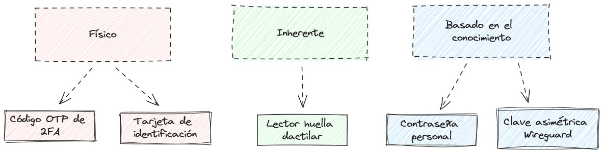

# Protocolos de seguridad

Basándonos en los métodos de autenticación considerados para la empresa, hemos estudiado una serie de protocolos de seguridad, haciendo hincapié en los pasos necesarios para obtener acceso y la infraestructura necesaria para poder hacer funcionar estas medidas de seguridad.

A fin de clasificar los métodos estudiados se ha realizado un esquema, separando los distintos tipos de autenticación en distintos tipos de acceso. 

Teniendo esto en cuenta, los métodos de autenticación  elegidos son:

- Códigos de un uso (OTP) con sistema de autentificación de dos factores (2FA).
- Tarjeta de identificación.
- Lector de huella dactilar.
- Contraseña personal.
- Clave asimétrica para el Wireguard.

## Índice

- [Protocolos](#protocolos)
    - [Protocolos referentes al código OTP](#protocolos-referentes-al-código-otp)
    - [Protocolos referentes a tarjetas de identificación](#protocolos-referentes-a-tarjetas-de-identificación)
    - [Protocolos referentes a lectores de huella dactilar](#protocolos-referentes-a-lectores-de-huella-dactilar)
- [Pasos a seguir](#pasos-a-seguir)
    - [Acceso al Email Corporativo](#acceso-al-email-corporativo)
        - [Código OTP ](#código-otp)
        - [Contraseñas](#contraseñas)
    - [Acceso físico a las instalaciones](#acceso-físico-a-las-instalaciones)
        - [Tarjetas de identificación](#tarjetas-de-identificación)
        - [Lectores de huella dactilar](#lectores-de-huella-dactilar)
    - [Acceso remoto](#acceso-remoto)
        - [Wireguard](#wireguard)

## Protocolos

### Protocolos referentes al código OTP

Algunos de los protocolos más usados para implementar códigos de un sólo uso (OTP) son los siguientes:

- **TOTP (Time-Based One-Time Password):** Es un algoritmo que genera códigos de un solo uso basados en un factor de tiempo, el cual usan el servidor y el dispositivo del usuario para sincronizarse, siendo generalmente un reloj en tiempo real. El usuario genera un código OTP utilizando una clave secreta y el factor de tiempo actual. Google Authenticator es un ejemplo popular de una aplicación que implementa TOTP.

- **HOTP (HMAC-Based One-Time Password):** HOTP es similar a TOTP, pero en lugar de utilizar un factor de tiempo, utiliza un contador sincronizado entre el servidor y el dispositivo del usuario. Cada vez que se genera un código OTP, el contador se incrementa en el servidor y en el dispositivo del usuario, garantizando que cada código usado sea único y se pueda verificar correctamente.

- **SMS OTP:** En este protocolo el usuario recibe un código de un solo uso a través de un mensaje de texto en su teléfono móvil. El código en cuestión se envía al número de teléfono registrado en el sistema y el usuario debe ingresar dicho código para poder autentificarse.

- **Email OTP:** Similar al SMS OTP, en este caso el usuario recibe el código de un solo uso a través de un correo electrónico. El código se envía a la dirección de correo electrónico registrada y el usuario debe ingresar el código para completar la autentificación.

### Protocolos referentes a tarjetas de identificación

Existen varios protocolos y tecnologías referentes al uso correcto y seguro de tarjetas de identificación. Algunos de los más relevantes son los siguientes:

- **RFID (Radio-Frequency Identification):** Protocolo que utiliza tecnología de radiofrecuencia para la comunicación entre la tarjeta y el lector. Hay diferentes tipos de RFID, como RFID de baja frecuencia (LF), alta frecuencia (HF) y ultra alta frecuencia (UHF), cada uno con sus propias características y aplicaciones. El protocolo RFID se utiliza principalmente en tarjetas de proximidad para el control de acceso físico.

- **NFC (Near Field Communication):** Similar a RFID, el protocolo NFC utiliza también comunicación de radiofrecuencia para la interacción entre dispositivos a corta distancia, sin embargo, NFC permite una interacción bidireccional y es compatible con dispositivos móviles, lo que lo hace adecuado para aplicaciones como pagos móviles y autenticación de identidad.

- **Smart Cards (Tarjetas inteligentes):** Las tarjetas inteligentes incorporan un chip integrado que puede almacenar y procesar datos de forma segura. Estos chips pueden contener certificados digitales, claves criptográficas y otra información de identificación. Las tarjetas inteligentes se utilizan en una multitud de aplicaciones, como autenticación de usuarios, pagos electrónicos y acceso a redes seguras.

### Protocolos referentes a lectores de huella dactilar

Los protocolos relacionados con los lectores de huellas dactilares se centran en la comunicación entre el lector y el sistema que verifica la identidad, siendo los mostrados a continuación algunos de los principales:

- **Biometric API (BioAPI):** BioAPI es un estándar de la industria desarrollado por el Consorcio de Interoperabilidad Biométrica (BIO), el cual proporciona una interfaz estándar para la integración de dispositivos biométricos, incluidos los lectores de huellas digitales, con aplicaciones de software. BioAPI permite que las aplicaciones accedan a los datos biométricos de manera uniforme, independientemente del tipo de dispositivo biométrico utilizado.

- **Fingerprint Image Interchange Format (FIIF):** FIIF es un protocolo que especifica el formato de intercambio de imágenes de huellas dactilares. Este define cómo se almacenan y se transmiten las imágenes de huellas dactilares entre diferentes sistemas y dispositivos.

- **Proprietary SDKs (Software Development Kits):** Muchos fabricantes de lectores de huellas digitales proporcionan SDKs propietarios que permiten a los desarrolladores integrar la funcionalidad del lector en sus aplicaciones. Estos SDKs suelen incluir protocolos de comunicación específicos para interactuar con los lectores y obtener datos de huellas dactilares.

## Pasos a seguir

### Acceso al Email Corporativo

#### Código OTP 

1. **Registro en el sistema de autentificación:** El trabajador nuevo deberá registrarse en el sistema de autentificación de la empresa, implicando que deba proporcionar información personal, como nombre de usuario, dirección de correo electrónico y número de teléfono móvil. Aún así se le proporcionará un teléfono móvil corporativo al nuevo empleado.

2. **Uso del protocolo SMS OTP:** El empleado proporcionará el número de télefono de su móvil corporativo, a fin de recibir un SMS con un código OTP. El código proporcionado será utilizado para obtener acceso al email corporativo.

#### Contraseñas

1. **Establecer una contraseña:** El nuevo empleado establecerá una contraseña para su cuenta de correo electrónico corporativo. Esta clave deberá cumplir con las medidas de seguridad vigentes.   

2. **Uso de la contraseña:** Cada vez que el usuario desee acceder a su cuenta de correo corporativo, este deberá usar la contraseña establecida, así como el código OTP de seguridad.

### Acceso físico a las instalaciones

#### Tarjetas de identificación

1. **Obtención de la tarjeta de identificación:** Una vez contratado, el empleado nuevo recibirá su tarjeta de identificación personal, la cual tendrá siempre a mano. Es necesario recalcar que esta es intrasferible, por lo que no deberá ser usada por otra persona que no sea su usuario original.

2. **Entrada y salida del recinto empresarial:** Para poder entrar o salir del recinto de la empresa, el trabajador deberá usar su tarjeta personal de identificación.

3. **Acceso a sala de servidores:** Los empleados pertenecientes al equipo TI tendrán acceso a la sala de servidores de la empresa. Para poder entrar, usarán su tarjeta de identificación. Esto se logra gracias a la tecnología de tarjetas inteligentes, que permiten al lector detectar el rango del empleado en su tarjeta.

#### Lectores de huella dactilar

1. **Acceso mediante huella digital:** Para un mayor nivel de seguridad, además del uso de tarjetas inteligentes de identificación, se usará un sistema  de acceso mediante lectores de huella digital para poder entrar en la sala de servidores. Sólo los empleados que trabajen en el departamento de IT tendrán este permiso.

### Acceso remoto

#### Wireguard

1. **Uso de Wireguard:** El empleado recibirá un portátil corporativo con el software Wireguard ya instalado. Este ya vendrá configurado previamente.

2. **Solicitud de admisión en la lista de Wireguard:** El empleado solicitará la admisión en la lista del sistema Wireguard, con el objetivo de poder conectarse de forma remota a los sistemas de la empresa. Esto se hará si se requiere registrar otro dispositivo en el sistema.

3. **Solitud de clave pública:** El equipo de IT le proporcionará al empleado la clave pública necesaria para conectarse al sistema Wireguard.

4. **Configuración del software Wireguard:** En el dispositivo adicional se realizará la configuración necesaria para conectarse a la empresa de forma remota. Esto incluirá añadir la clave pública recibida.

## Software e Infraestructura necesarios

### Códigos OTP

- **Proveedor de servicios de SMS:** Se necesitaría un proveedor de servicios de SMS que permita el envío de mensajes de texto a través de una API o una plataforma en la nube. 

- **Plataforma de autentificación:** También se requeriría una plataforma de autentificación que pueda generar códigos OTP y enviarlos a través del proveedor de servicios de SMS. Esta plataforma puede ser desarrollada internamente o adquirida como un servicio externo. Ejemplos de plataformas de autenticación incluyen Authy, Google Authenticator, y soluciones de autenticación multifactor basadas en la nube.

- **Base de datos de usuarios:** Finalmente, se necesita una base de datos de usuarios donde almacenar los números de teléfono móvil de los empleados o usuarios autorizados.

### Tarjetas de identificación

- **Software de Control de Acceso:** Este software se utiliza para controlar el acceso físico a las instalaciones de la empresa. Permite configurar políticas de acceso, gestionar lectores de tarjetas y registrar eventos de acceso.

- **Lectores de Tarjetas:** Se necesitarían lectores de tarjetas instalados en los puntos de acceso físico para leer las tarjetas de identificación de los empleados.

- **Base de Datos de Empleados:** Es importante disponer de una base de datos centralizada que almacene la información de los empleados, incluidos sus nombres, números de identificación únicos y otros datos relevantes. 

### Lectores de huellas dactilares

- **Lectores de Huellas Dactilares:** Sería necesario instalar los propios lectores de huellas dactilares en los puntos de acceso físico a zonas cruciales de la empresa, como la sala de servidores. 

- **Software de Reconocimiento de Huellas Dactilares:** Se requiere de software especializado que sea capaz de capturar, almacenar y verificar las huellas dactilares de los empleados. Este software debe ser capaz de comparar la huella dactilar escaneada con las huellas almacenadas en una base de datos y determinar si hay una coincidencia.

- **Sistema de Gestión de Huellas Dactilares:** Se necesita un sistema para gestionar las huellas dactilares de los empleados, incluida su captura, almacenamiento y administración. Este sistema también podría permitir la asociación de las huellas dactilares con otros datos de identificación del empleado, como nombres, números de identificación, etc, centralizando todos los datos en una sola base de datos.

- **Base de Datos de Huellas Dactilares:** Una base de datos centralizada donde almacenar las huellas dactilares de los empleados de manera segura y protegida. Esta base de datos se utilizaría para comparar las huellas dactilares escaneadas con las huellas almacenadas durante el proceso de verificación, además de para almacenar otros datos de los empleados.

### Wireguard

- **Servidores WireGuard:** Es necesario configurar servidores WireGuard para facilitar la conectividad entre las redes de la empresa. Estos servidores actuarán como puntos de entrada y salida para el tráfico VPN. 

- **Clientes WireGuard:** Los clientes WireGuard son las aplicaciones instaladas en los dispositivos de los usuarios para permitir la conexión a la red VPN. Estos clientes deben ser compatibles con el sistema operativo de los dispositivos y se encargarán de establecer y gestionar la conexión VPN.

- **Configuración del Túnel VPN:** Deberás configurar y gestionar los túneles VPN utilizando la infraestructura de WireGuard. Esto incluirá la generación de claves públicas y privadas, así como la configuración de las interfaces de red en los servidores y clientes WireGuard.

- **Gestión de Claves Públicas y Privadas:** WireGuard utiliza pares de claves asimétricas (pública y privada) para establecer conexiones seguras. Necesitarás gestionar y almacenar de forma segura estas claves para cada servidor y cliente WireGuard.